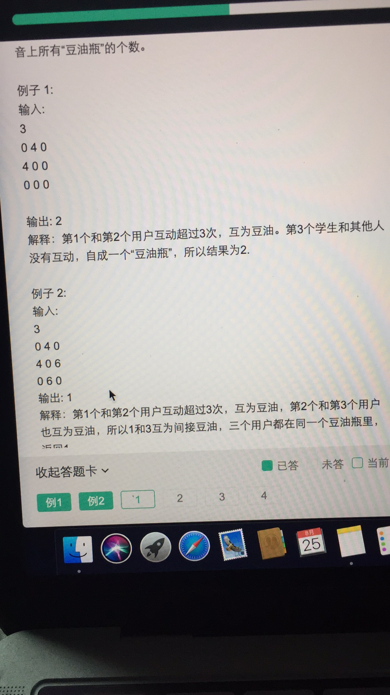
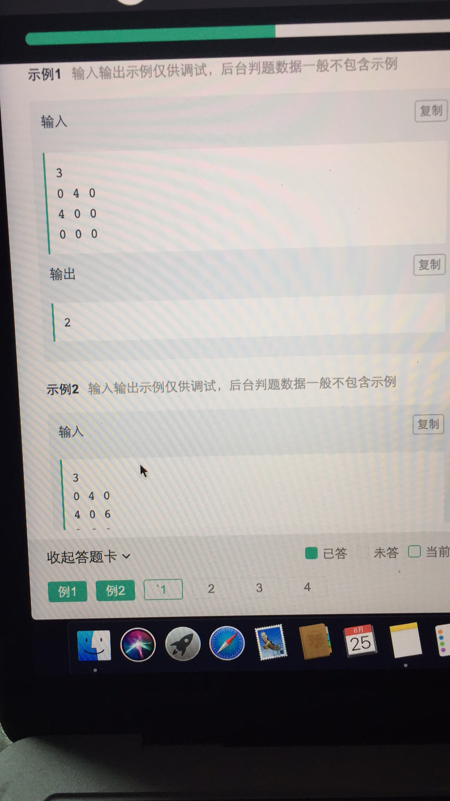
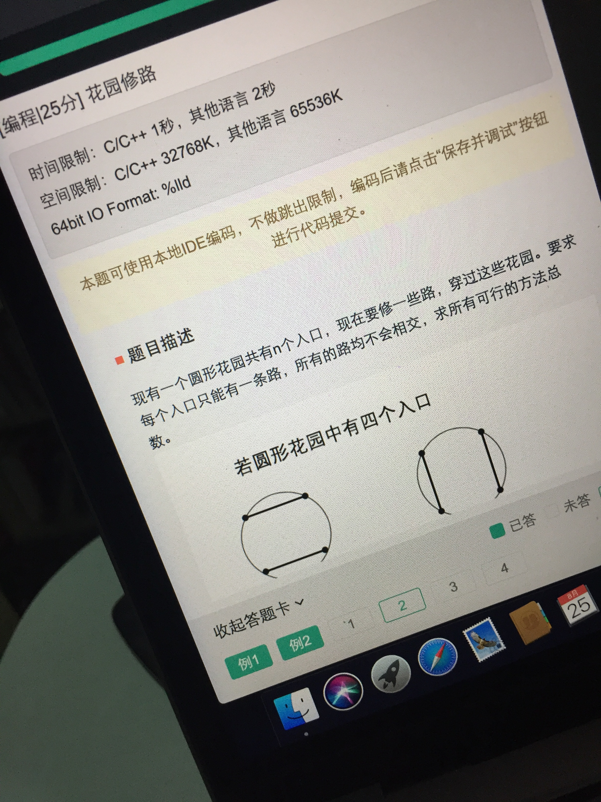
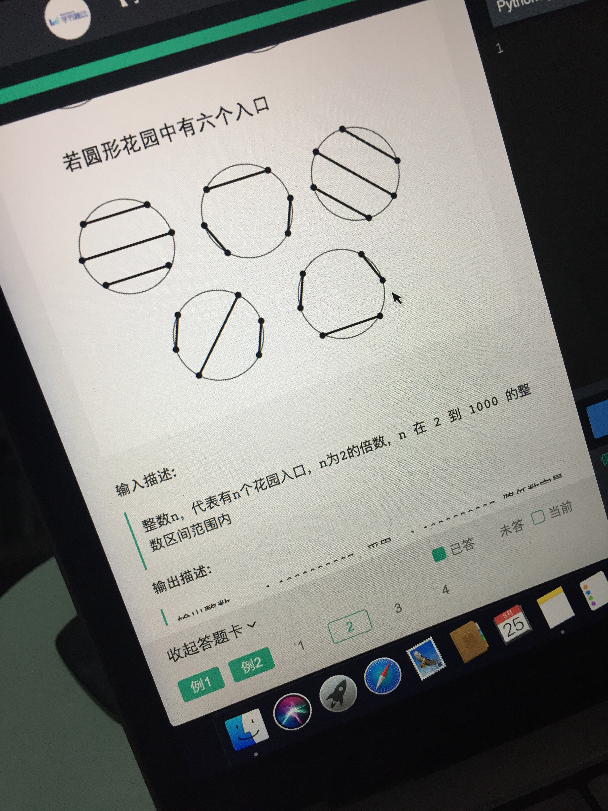
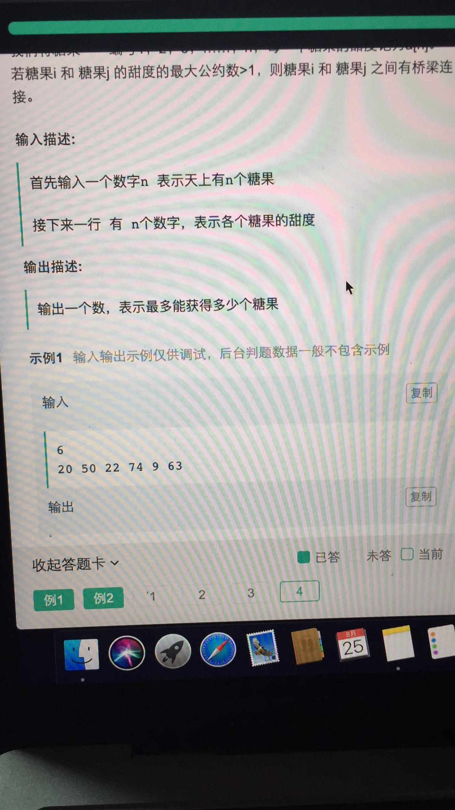

# 字条跳动 8月25日 笔试

## 第一题

~~~python
def solution(M):
    p = list(range(len(M)))      #并查集元素初始化, 各个元素对分到自己的组别
    def f(x):
        if p[x] != x:       #递归修改所属集合
            p[x] = f(p[x])
        return p[x]
    res = len(M)
    for row in range(len(M)):
        for col in range(len(M[0])):
            if row != col and M[row][col] >= 3:
                px, py = f(row), f(col)
                if px != py:        #检查集合，如果集合不同就合并
                    p[py] = px
                    res -= 1
    return res

#M = [[0,4,0],[4,0,0],[0,0,0]]
#M = [[0,4,0],[4,0,6],[0,6,0]]
#print(solution(M))
    
import sys
N = int(sys.stdin.readline().strip())
M = []
for _ in range(N):
    line = sys.stdin.readline().strip()
    a = list(map(int, line.split()))
    M.append(a)
print(solution(M))
~~~

 ## 第二题

## 第三题

~~~python
def solution(n, matrix):
    if n == 1:
        for i in range(1, 4):
            for k in range(0, 4):
                for j in range(0, i):
                    if matrix[i - j][k] == matrix[i - j - 1][k]:
                        matrix[i - j - 1][k] *= 2
                        matrix[i - j][k] = 0
                    if matrix[i - j - 1][k] == 0:
                        matrix[i - j - 1][k] = matrix[i - j][k]
                        matrix[i - j][k] = 0
    if n == 2:
        for i in range(2, -1, -1):
            for k in range(0, 4):
                for j in range(0, 3 - i):
                    if matrix[i + j][k] == matrix[i + j + 1][k]:
                        matrix[i + j + 1][k] *= 2
                        matrix[i + j][k] = 0
                    if matrix[i + j + 1][k] == 0:
                        matrix[i + j + 1][k] = matrix[i + j][k]
                        matrix[i + j][k] = 0
    if n == 3:
        for j in range(1, 4):
            for k in range(0, 4):
                for i in range(0, j):
                    if matrix[k][j - i] == matrix[k][j - i - 1]:
                        matrix[k][j - i - 1] *= 2
                        matrix[k][j - i] = 0
                    if matrix[k][j - i - 1] == 0:
                        matrix[k][j - i - 1] = matrix[k][j - i]
                        matrix[k][j - i] = 0
    if n == 4:
        for j in range(2, -1, -1):
            for k in range(0, 4):
                for j in range(0, 3 - i):
                    if matrix[j + i][k] == matrix[j + i + 1][k]:
                        matrix[j + i + 1][k] *= 2
                        matrix[j + i][k] = 0
                    if matrix[j + i + 1][k] == 0:
                        matrix[j + i + 1][k] = matrix[j + i][k]
                        matrix[j + i][k] = 0
    return matrix

import sys
n=int(sys.stdin.readline().strip())
matrix=[]
for _ in range(4):
    line=sys.stdin.readline().strip()
    line=list(map(int,line.split()))
    matrix.append(line)
print(solution(n,matrix))
~~~

## 第四题

~~~python
# 各有各的甜度
from collections import defaultdict

def _get_gcd(a, b):
    while a%b != 0:
        a, b = b, a % b 
    return b > 1

class solution:
    
    def get_max_sweets(self, sweets):
        n = len(sweets)
        neighbors = defaultdict(list)
        for i in range(n):
            for j in range(n):
                if i != j:
                    if _get_gcd(sweets[i], sweets[j]):
                        neighbors[i].append(j)
    #    print(neighbors)
                    
        self.res = 0
        def dfs(i, path, visited):
            end = True
            for j in neighbors[i]:
                if j not in visited:
                    end = False
                    visited.add(j)
                    dfs(j, path+[j], visited)
                    visited.remove(j)
            if end:
                self.res = max(self.res, len(path))
#                print(path)
        for i in range(n):
            dfs(i, [i], {i})
        return self.res

#print(solution().get_max_sweets([20,50,22,74,9,63]))

import sys
n = int(sys.stdin.readline().strip())
line = sys.stdin.readline().strip()
sweets = list(map(int, line.split()))
print(solution().get_max_sweets(sweets))
~~~

